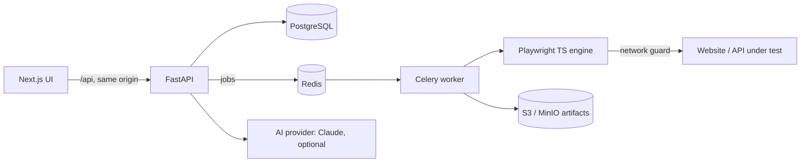

# LorvenLax AI Testing Platform

**Lorven Lax Tech Labs Pvt. Ltd.**

LorvenLax is a browser-based, multi-tenant testing platform. Point it at a website or an API specification, review the tests it proposes, and run them in isolated cloud browsers. You see real results with screenshots, videos, traces and failure analysis. You don't need to write code or know Playwright.

The app opens on three options:

| Option | You provide | The platform |
|---|---|---|
| **Test a Website** | A URL, and a test login if the site needs one | Discovers pages, forms and links, generates scenarios, writes Playwright tests, runs them, and analyses failures |
| **Test an API** | An OpenAPI/Swagger file, a Postman collection, a spec URL, or a single request | Finds endpoints, then generates positive, negative, boundary, auth, duplicate, not-found and schema tests, and runs them |
| **Describe a Test** | Instructions in plain English | Builds editable steps from what discovery found, flags missing test data, validates and compiles the code, runs it, and explains the result |

Underneath, the platform also has a drag-and-drop **visual test builder**, suites, environments with encrypted secrets, CI/CD triggers, self-healing locator suggestions, and HTML/PDF/Allure reports.

## How it is built



- **The AI agents never write executable code.** They produce structured, schema-checked test steps. A deterministic generator turns those steps into Playwright TypeScript, putting every value inside a JSON string literal. Text on a page under test therefore can't inject code.
- **Execution, assertions, scheduling and reporting are deterministic.** AI is used where reasoning helps: proposing scenarios, interpreting plain English, and explaining failures. Without an AI key, built-in deterministic agents do this work, and the UI says which engine produced each plan.
- **Results are never fabricated.** Every status shown comes from a Playwright run that was recorded. Generated tests stay marked "Generated" until they actually run.

See [docs/ARCHITECTURE.md](docs/ARCHITECTURE.md) for the full design, [docs/SETUP.md](docs/SETUP.md) to run it, and [docs/PROGRESS.md](docs/PROGRESS.md) for what is done, what is pending, and the verification evidence.

## Quick start (Docker)

```bash
cp .env.example .env          # then fill in LLX_SECRET_KEY, LLX_ENCRYPTION_KEY and the passwords (commands are in the file)
docker compose up -d --build
open http://localhost:3000    # register, create a project, choose "Create Test"
```

The stack includes **Acme CRM**, a sample application to try the platform on. Inside the stack its address is `http://sample:8100` (website and OpenAPI spec at `/openapi.json`). The demo login is `demo@acme.test` / `Passw0rd!` and the API token is `demo-token`.

To enable Claude, set `LLX_ANTHROPIC_API_KEY` (and optionally `LLX_AI_MODEL`, default `claude-opus-5-5`) in `.env`.

## Repository layout

```
backend/      FastAPI app, SQLAlchemy models, Alembic migrations, agents, Celery worker, tests
engine/       Playwright TypeScript runtime, network guard, website crawler, PDF renderer
frontend/     Next.js + Tailwind (shadcn/ui-style) web app
sample-app/   Acme CRM: the controlled application used by the end-to-end tests
e2e/          Playwright tests that drive the UI through all three workflows
docs/         Architecture, setup, progress and CI/CD adapters (docs/ci)
testgen/      Boundary-value engine reused by API test planning (original CLI and workbench)
scripts/      Local development helpers
```

## Tests

```bash
cd backend && pytest             # 60 tests: security, tenancy, agents, and integration runs against the sample app
cd e2e && npx playwright test    # 6 UI tests for the three workflows and the visual builder (stack must be running)
```
