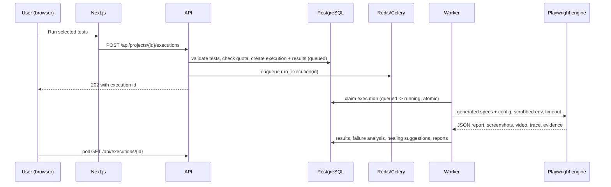

# Architecture

## Components

| Component | Technology | Responsibility |
|---|---|---|
| Web app | Next.js 15, React 19, TypeScript, Tailwind, Radix (shadcn/ui-style components), SWR | All user-facing screens. Calls `/api/*` on its own origin; Next.js rewrites to the API so session cookies stay first-party |
| API | FastAPI, SQLAlchemy 2, Pydantic | Auth, tenancy, CRUD, validation, job submission, reports, artifact access. Never runs tests inside a request |
| Database | PostgreSQL 16, Alembic migrations | 26 tables. Relational, with JSON only for naturally nested data (locators, discovered forms, schemas) |
| Queue | Redis + Celery | Durable jobs: executions, website discovery, test generation. `acks_late` + atomic row claims make redelivery safe |
| Worker | Celery + Node.js | Runs the Playwright engine in a per-run work directory with a scrubbed environment and time limits |
| Engine | Playwright 1.56 (TypeScript), Ajv | `runtime.ts`: step implementations, locator resolution, API requests with schema checks, network guard, failure evidence. `discover.ts`: crawler. `pdf.ts`: report rendering |
| Artifact storage | Shared Docker volume (default) or S3 / S3-compatible storage | Screenshots, videos, traces, API evidence, DOM snapshots, HTML/PDF reports |
| AI provider | Anthropic Claude through `agents/llm.py` | Structured JSON output only. Optional; deterministic agents are always available |

## Request and job flow

## The step model

Every test is an ordered list of structured steps (`navigate`, `click`, `fill`, `select`, `assert_*`, `api_request`, `store_text`, `set_variable`, …; see `backend/app/services/steps.py`). This one representation is shared by:

- the visual builder (users edit steps directly),
- the website and API planners and the natural-language agent (they produce steps),
- the validation agent (it checks steps),
- the code generator (it turns steps into Playwright TypeScript for each run).

Locators are structured objects (`{strategy: role|label|text|placeholder|testid|css, value, name}`), so they can be checked against discovery data and repaired by the healing agent. Test data uses `{{variable}}` placeholders, resolved at run time from the environment. Secrets are decrypted only inside the worker.

## Agents

| Agent | Where | Deterministic core | Where AI is used (if configured) |
|---|---|---|---|
| Application Discovery | `agents/discovery.py`, `engine/src/discover.ts` | Same-origin breadth-first crawl with page and depth limits; optional login; destructive links (logout, delete…) are skipped; forms are never submitted; re-checks pages anonymously to mark the ones that need a login | – |
| Requirements Analysis / NL | `agents/nl_agent.py` | Rule engine maps clauses to discovered pages and elements, lists missing prerequisites and asks about unmapped clauses | Claude plans steps from the instruction, the conversation and the discovery data |
| Test Planning + Generation (web) | `agents/website_planner.py` | Page smoke, navigation, valid/invalid login, mandatory fields, invalid email, form submission, `maxlength` boundaries, tables. Each expectation is tagged *discovered*, *confirmed* or *inferred* | Claude proposes extra journeys; any scenario whose locators were not seen during discovery is rejected |
| Test Planning + Generation (API) | `agents/api_planner.py` | Chained create-then-read requests, auth, missing fields, wrong types, formats, enums, length and numeric boundaries (via `testgen`), malformed JSON, duplicates, not-found. Status codes come from the spec, or a class range is stated when undocumented | Claude proposes business-rule scenarios; any expected status not documented in the spec is rejected |
| Validation | `agents/validation.py` | Known actions, required fields, locator sanity, network policy on literal URLs, at least one assertion, variables defined, locators seen in discovery, plus a real Playwright compile-and-list pass | – |
| Execution | `services/runner.py` | Isolated run directory, scrubbed environment, timeouts, cancellation, retries, artifacts, secret redaction | – |
| Self-Healing | `agents/healing.py` | Scores candidates captured from the page at failure time (similarity, uniqueness, role). Suggestions only; accepting one changes only that step's locator and is written to the audit log | – |
| Failure Analysis | `agents/failure_analysis.py` | Classifies failures (application defect, automation, environment, test data, locator, assertion, timeout, flaky, unknown) with a confidence, and keeps *verified* evidence separate from *hypotheses* | – |
| Reporting | `agents/reporting.py` | Pass rates, trends, flaky detection, critical failures, recommendations, HTML/PDF/Allure exports from persisted data | – |

Agents exchange structured data (dataclasses and JSON-schema-validated dicts), never free-form instructions. Content from tested sites, specs and users reaches the model only inside `<untrusted_data>` blocks, under a system rule that it is data, not instructions.

## Multi-tenancy and authorization

- Organization → projects → everything else. Membership roles: owner, admin, member, viewer.
- Every project-scoped endpoint loads the project and checks the caller's role in its organization (`deps.load_project`). Rows are never fetched by id alone. Cross-tenant requests return 404, so ids can't be probed. `tests/test_tenancy_and_auth.py` checks 20 endpoints with an outsider account.
- Artifacts are served only through `/api/artifacts/{id}` after the same project check. Storage keys are generated by the platform and prefixed by organization and project.
- Browser sessions use an httpOnly session cookie plus a double-submit CSRF token. CI uses project-scoped API tokens (`llx_…`, stored hashed). Passwords are hashed with scrypt.
- The audit log records sign-ins, project, test and environment changes (never secret values), authorisation confirmations for discovery, runs, invitations, token changes, and every healing decision.

## Security controls

| Threat | Control |
|---|---|
| SSRF from discovery, spec import, tests | `security/ssrf.py` validates submitted URLs (private, loopback, link-local, CGNAT, metadata, non-HTTP schemes, credentials in URLs). `engine/src/guard.ts` re-checks **every** browser request and API call at run time, including redirects and URLs built from variables. Hosts can be allowed explicitly with `LLX_ALLOWED_PRIVATE_HOSTS` |
| Code injection through generated tests | AI and users produce data, not code. The code generator only emits `json.dumps`-escaped literals into calls on a fixed runtime |
| Secret leakage | Fernet encryption at rest; secrets are decrypted only in the worker, passed as environment data, and redacted from errors, logs, attachments and AI prompts. Never returned by the API |
| Unauthorised targets | Discovery needs an explicit "I am authorized" confirmation, recorded with the user and time |
| Resource abuse | Rate limits (auth, jobs), monthly test-run quota per organization, run time limit, worker CPU/memory/PID limits, non-root and capability-free worker container |
| Destructive actions during discovery | No form submission (except the login you configure), and destructive-looking links are skipped |

## Data model (main tables)

`users`, `organizations`, `memberships`, `invitations`, `user_sessions`, `api_tokens`, `projects`, `environments`, `environment_variables`, `test_cases`, `test_steps`, `test_suites`, `suite_items`, `test_executions`, `test_results`, `test_artifacts`, `healing_suggestions`, `site_discoveries`, `discovered_pages`, `api_collections`, `api_endpoints`, `ai_generation_jobs`, `assistant_conversations`, `assistant_messages`, `audit_logs`. The schema is defined in `backend/app/models.py` and migrated with Alembic (`backend/alembic/versions`).
